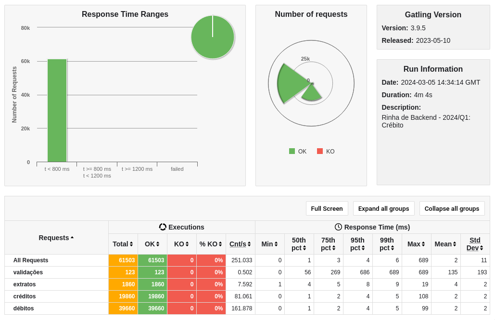

# Rinha2024

Implementação em Python para a [Rinha de Backend 2ª edição
](https://github.com/zanfranceschi/rinha-de-backend-2024-q1), usando framework
web [Starlette](https://www.starlette.io)

## Tecnologias

- Python;
- Postgres;
- Nginx.
